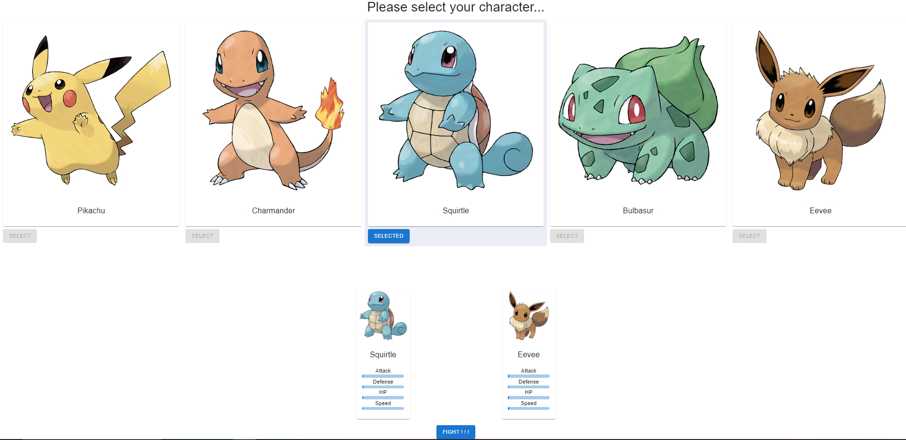

# Poke-Battle App

## Descripción

La **Poke-Battle App** es una aplicación web interactiva donde los usuarios pueden seleccionar sus Pokémon favoritos, enfrentarlos en batallas y ver quién sale victorioso. La aplicación permite a los usuarios elegir un Pokémon y un oponente aleatorio de una lista, realizar una batalla y mostrar el resultado en la interfaz.

### Características

- **Selecciona un Pokémon**: Escoge un Pokémon de la lista disponible.
- **Oponente Aleatorio**: El oponente se seleccionará de manera aleatoria.
- **Batalla de Pokémon**: Envía una solicitud para enfrentar al Pokémon seleccionado contra el oponente y recibe el resultado.
- **Visualización de Estadísticas**: Muestra estadísticas de ataque, defensa, HP y velocidad en una barra de progreso para ambos Pokémon.
- **Interfaz Responsiva**: Se adapta a diferentes tamaños de pantalla para una mejor experiencia de usuario.

### Tecnologías

- **Frontend**: React, Material-UI
- **Backend**: NestJS (Node.js), TypeORM, SQLite
- **API**: RESTful, comunicación con el backend para manejar batallas

### Instalación

1. **Clona el repositorio:**

   ```bash
   git clone https://github.com/tu-usuario/pokemon-battle-app.git
   cd pokemon-battle-app
   ```

2. **Instala las dependencias para el frontend y el backend:**

   ```bash
   pnpm install
   ```

3. **Inicia el servidor de desarrollo para el frontend:**

   ```bash
   pnpm run dev
   ```

4. **Inicia el servidor de desarrollo para el backend:**

   ```bash
   pnpm run start
   ```

   La aplicación se ejecutará en `http://localhost:3000` y la interfaz gráfica en el puerto `http://localhost:5173`.

### Node Version

La aplicación requiere Node.js versión `14.x` o superior. Asegúrate de tener la versión adecuada instalada:

```bash
node -v
```

## Primeros pasos:

Existe un archivo en la raíz del proyecto `backend\poke-battle\pokemon-data.json` con una coleccion del personajes.

En un archivo `backend\poke-battle\src\main.ts` existe un script que al descomentarlo crea la coleccion en la base de datos.

Finalmente la base de datos contiene los datos y almacena los registros de batallas.

#### Selecciona tu Pokemón


#### Un oponente aleatorio se selecciona



#### El ganador se muestra en pantalla


### Contacto

Si tienes alguna pregunta o necesitas ayuda, no dudes en contactarme:

- **Correo electrónico**: ojmanias1985@gmail.com
- **GitHub**: [Omar Jesús Manias](https://www.linkedin.com/in/omar-jesus-manias/)
